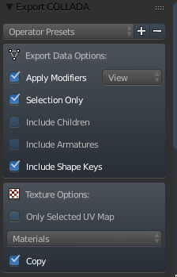

# Creating EZ-RASSOR Parts with Blender

## Blender version used
2.79   
Download the latest version from the official [Blender Website](https://www.blender.org/download/).

## Items in this folder
- **EZ_RASSOR.blend:**
  - This file is the "project" file for all of the Blender objects that were assembled. Open this to begin Blender development.
- **objects folder:**
  - Staging folder when importing .obj files (optional)
- **meshes folder:** 
  - Destination folder when exporting items from Blender (optional)

## Improving existing models
Although Gazebo allows you to specify the pose of objects when building a robot, the initial pose for an object with a custom mesh is __definitely__ affected by the (x,y,z) values for the Blender objects as you export them. **Always export values at (0, 0, 0) one at a time.

Therefore, when you work with the .blend file to modify the existing pieces to the EZ-RASSOR, make sure you take the following two things into account: the required export pose and the export format.

#### Export Pose
Once Blender is open with the EZ-RASSOR file, open up the Text Editor window (Bottom Right) and take note of the values specified there. It includes a reminder that the exports should be at (0, 0, 0) and also includes the z values to set every object to if you want to view them in Blender at their relative heights to each other.   
   

#### Export Format
For modularity, export objects **one item at a time**. Also ensure that you export the files as .dae files since that format works well with Gazebo *and* displays the model with the proper colors. 

To do this (from object mode) type "b" and drag the cursor down over the object. Once it is selected, select **File -> Collata (Default) (.dae)**. Under Export Settings, check the box for **Apply Modifiers** and **Selection Only**. Leave all other default values as they are. Then export the file to the EZ-RASSOR description directory as normal.  
*At the time of this writing, you would place the file in packages/simulation/ezrassor_sim_description/meshes*  

  

## Adding new models
Adding new models to the robot is fairly straightforward. As before, the only thing to note is that objects should be exported while they are in (0, 0, 0) position. This will help significantly when configuring the robot in the .XACRO file. 

## Important Notes
- When configuring the colors for the model, DO NOT enable transparency on the materials. Gazbeo-7 could still render the objects but Gazebo-9 would not show the meshes at all when transparency was enabled. Therefore, just do not enable transparency.
