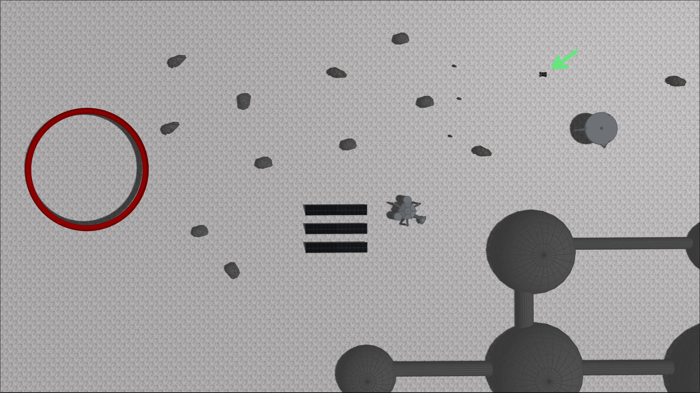

# IROS 2020 - ISRU Tutorials

## Background
> Space is hard. Robots make things slightly easier. 

In 2018, the [Florida Space Institute](https://fsi.ucf.edu) tasked 10 UCF computer science students with creating an open-source, low cost, [excavation robot](https://blogs.nasa.gov/kennedy/2016/10/03/rassor-marco-polo-demonstrate-resource-utilization-on-mars/) from scratch. The result is an actively-developed simulation that gives students and educators the ability to drive a mining robot around the Moon, and provides researchers a platform to investigate advanced space robotics algorithms such as new machine learning or computer vision techniques off-world.

In the following tutorials you will learn how to operate the Easy Regolith Advanced Surface Systems Operations Robot, or EZRASSOR for short. The EZRASSOR is modeled after the NASA RASSOR, a robot designed to make living on the Moon sustainable by autonomously collecting regolith for later human use. To learn more about our project's background, check out our first [Medium post](https://medium.com/ez-rassor/introducing-the-ez-rassor-35dd0eb5c121).

.

## Introduction

Imagine you're an astronaut tasked with mining regolith on the Moon's surface and depositing it into an *in-situ* hopper for processing. First, you'll directly control the robot (as if you were on the surface of the Moon next to the machine). Next you'll plan the robot's movements ahead-of-time from Earth and upload a list of actions that the robot will execute in order. Writing this list will take some trial-and-error (remember we said space is hard!). Finally, you'll give up control and watch the EZRASSOR navigate and excavate on its own by providing it with a target dig site and turning on its autonomous systems.

## Tutorial 0: Setup
Before you begin, you must install the EZRASSOR software suite on your computer. Note that the software and these tutorials assume you are using Ubuntu Bionic (18.04) and Bash. The simulation runs best when a graphics card is available, however a sufficiently modern integrated graphics card can these tutorials if necessary.

### Install ROS Melodic
Full ROS installation instructions are available [on the ROS wiki](http://wiki.ros.org/melodic/Installation/Ubuntu), but we have consolidated the commands you need here:
```shell
sudo sh -c 'echo "deb http://packages.ros.org/ros/ubuntu $(lsb_release -sc) main" > /etc/apt/sources.list.d/ros-latest.list'
sudo apt-key adv --keyserver 'hkp://keyserver.ubuntu.com:80' --recv-key C1CF6E31E6BADE8868B172B4F42ED6FBAB17C654
sudo apt update
sudo apt install ros-melodic-desktop-full
echo "source /opt/ros/melodic/setup.bash" >> ~/.bashrc
source /opt/ros/melodic/setup.bash
```

*NOTE: The above commands add a line to your `.bashrc`. Feel free to remove this line after completing the tutorial.*

### Install the EZRASSOR from Source
With ROS installed, you can now build the EZRASSOR from source. Execute these commands (more details in [the README](README.rst)):
```shell
sudo apt install python-pip python-rosdep python-rosinstall python-rosinstall-generator python-wstool build-essential git
sudo rosdep init
rosdep update
git clone https://github.com/FlaSpaceInst/EZ-RASSOR.git
cd EZ-RASSOR
sh develop.sh setup
sh develop.sh link
sh develop.sh resolve
sh develop.sh build
sh develop.sh install
echo "source ~/ezrassor_ws/install/setup.bash" >> ~/.bashrc
source ~/ezrassor_ws/install/setup.bash
```
*NOTE: The above commands add another line to your `.bashrc`. Feel free to remove this line after completing the tutorial.*

If you encounter `Sub-process /usr/bin/dpkg returned an error code...`, try to fix the broken install with the following command, then rerun the original command:
```shell
sudo apt --fix-broken install
** RERUN ORIGINAL COMMAND **`
```

You should be all set! Proceed to the first tutorial.

## Tutorial 1: Direct Operation
It's time to drive on the Moon! Launch the EZRASSOR simulation with keyboard controls via this command:
```shell
roslaunch ezrassor_launcher tutorial.launch tutorial:=iros1 
```
The simulation should load in just a moment (the first load can take several minutes). Once you can see the robot, you may want to right click it and hit `Follow` so the camera moves with the robot. When you're ready, manipulate the rover with the following keybindings:
```
← -> move left
↑ -> move forward
↓ -> move backward
→ -> move right

U -> raise front arm
J -> lower front arm
I -> raise back arm
K -> lower back arm

Y -> dig with front drum (rotate forward)
H -> dump from front drum (rotate backward)
O -> dig with back drum (rotate forward)
L -> dump from back drum (rotate backward)
```
See if you can perform these actions:
- Drive to the dig site (red half-dome) while avoiding rocks
- Dig at the dig site with both arms down
- Drive on top of the drums (with the wheels up off the ground)
- Flip the rover over! (hint: use the arms)

Kill the simulation with `Ctrl-C` in the terminal window when you're ready to move on.

## Tutorial 2: Delayed Teleoperation
Direct control becomes infeasible at great distances (it can take up to 13 minutes to send a signal to Mars). In real life, rovers are usually given a list of instructions/actions which are then executed in order. The following tutorial demonstrates this form of *indrect* control.

**Your goal is to drive the EZRASSOR (green arrow) to the target dig site (red ring) by providing a list of actions (drive forward, turn right, etc) which will be executed in order.** 



First, start the simulation:
```shell
roslaunch ezrassor_launcher tutorial.launch tutorial:=iros2
```

Before writing your action list, your should do some experimentation in the simulation to figure out what actions you need to reach your goal. Open up another terminal window and launch the Python interpreter:
```shell
export ROS_NAMESPACE=ezrassor1
python
```
The `ROS_NAMESPACE` variable ensures that your terminal window is configured with the correct namespace for the spawned robot. Next, import our TeleopActionClient class and instantiate it:
```python
from ezrassor_teleop_actions import TeleopActionClient
client = TeleopActionClient()
```

Now you can use this client to send actions to the EZRASSOR. Each action is a string containing a command and a duration (in seconds) for the command. The client accepts actions as a list. Try the client out by raising the arms of the EZRASSOR (you don't want them to drag on the ground while you drive!):
```python
client.send_movement_goal(["raise-front-arm 2.0", "raise-back-arm 2.0"])
```
Here is the full list of available commands with some useful tips:

|         Command         |                 Tips                  |
|:-----------------------:|:-------------------------------------:|
|      move-forward       | 1.25 seconds => 1 meter displacement  |
|      move-backward      | 1.25 seconds => 1 meter displacement  |
|       rotate-left       |  1.0 second => 90 degree left turn    |
|      rotate-right       |  1.0 second => 90 degree right turn   |
| raise-[front\|back]-arm |  2.0 seconds => 90 degree raise       |
| lower-[front\|back]-arm |  2.0 seconds => 90 degree lower       |
| dig-[front\|back]-drum  | 1.25 seconds => 1 complete revolution |
| dump-[front\|back]-drum | 1.25 seconds => 1 complete revolution |
|          stop           |            stops the robot            |

Fiddle with sending actions to the robot and try to reach the dig site! Keep track of your actions so you can produce a finished list later, and know that this is difficult... like really really difficult, even for us.

Once you feel ready to try your finished list of actions, kill the simulation with `Ctrl-C` in the original terminal window, then create a new text file. Feel free to close the Python interpreter as well.

Add your actions to the text file, new-line separated, like this:
```
move-forward 1.5
rotate-left 2.2
move-backward 8.1
# etc, etc...
```
Then relaunch the simulation:
```shell
roslaunch ezrassor_launcher tutorial.launch tutorial:=iros2
```

Finally, open up another terminal window and upload your action list:
```shell
export ROS_NAMESPACE=ezrassor1
rosrun ezrassor_teleop_actions process_actions /path/to/your/action/list
```

Did you make it to the dig site? If so, congratulations! If not, keep trying!

If you'd like to see or execute our action list solution, execute these commands in a separate window with the simulation running:
```sh
export ROS_NAMESPACE=ezrassor1
cat ~/ezrassor_ws/src/ezrassor_teleop_actions/examples/tutorial-solution.txt 
rosrun ezrassor_teleop_actions process_actions ~/ezrassor_ws/src/ezrassor_teleop_actions/examples/tutorial-solution.txt
```

Kill the simulation with `Ctrl-C` in the terminal window when you're ready to move on.

## Tutorial 3: Autonomous Operation
Direct control and action lists require human time and effort, and are prone to human error. Also, when a robot is controlled by a person it becomes much more difficult and costly to maintain consistent uptime (where the robot is actively harvesting resources). Can we build robots that require no manual intervention?

The answer is yes! The EZRASSOR includes many autonomous systems that allow the robot to operate continously without additional inputs or instructions. It can navigate to a dig site, dodge rocks and obstacles along the way, dig for a set amount of time, and then return home safely to dump its load and repeat the process.

To watch the robot do work on its own, first launch the simulation:
```shell
roslaunch ezrassor_launcher tutorial.launch tutorial:=iros3
```
Now press `2` on your keyboard and the robot will execute its "auto-dig" procedure. Press `3` to see the "auto-dump" procedure.

That's not all! To start "full autonomy", press `5`. The robot will navigate to a pre-programmed dig site, dig for some time, journey back home, and dump its drum contents. It will continue this cycle over and over until the simulation closes or you hit `0`.

*NOTE: Autonomy is hard to perfect. Our system has a number of small bugs and idiosyncrasies. If something weird happens during this tutorial, or if the robot gets stuck, try restarting the simulation and consider [creating an issue in our repository](https://github.com/FlaSpaceInst/EZ-RASSOR/issues).*

That concludes this set of tutorials for the EZRASSOR! Consider giving us a star on [our repository](https://github.com/FlaSpaceInst/EZ-RASSOR) if you enjoyed this or [reach out with feedback/issues](https://github.com/FlaSpaceInst/EZ-RASSOR/issues).
